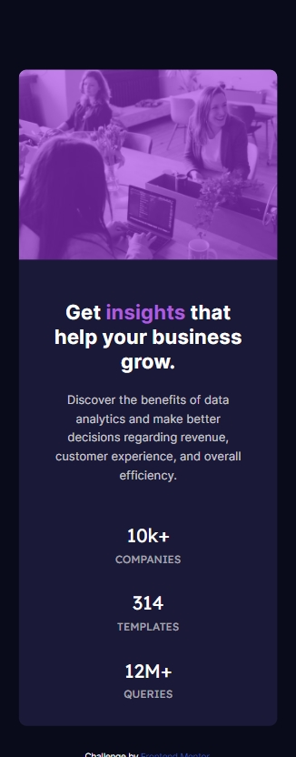
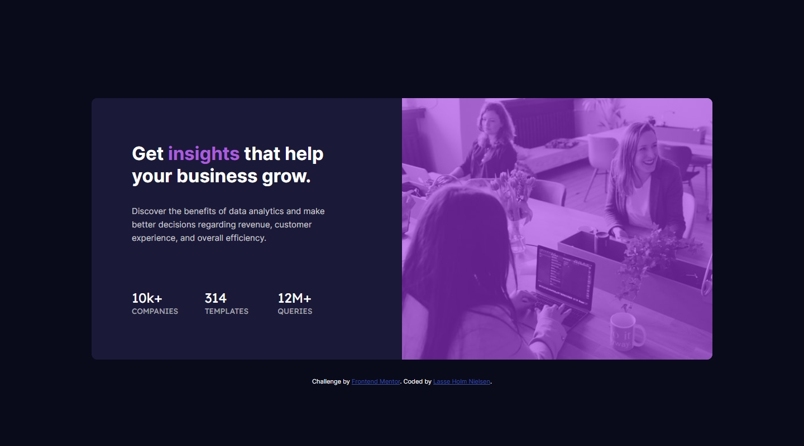

# Frontend Mentor - Stats preview card component solution

This is a solution to the [Stats preview card component challenge on Frontend Mentor](https://www.frontendmentor.io/challenges/stats-preview-card-component-8JqbgoU62). Frontend Mentor challenges help you improve your coding skills by building realistic projects. 

## Table of contents

- [Overview](#overview)
  - [The challenge](#the-challenge)
  - [Screenshot](#screenshot)
  - [Links](#links)
- [My process](#my-process)
  - [Built with](#built-with)
  - [What I learned](#what-i-learned)
  - [Continued development](#continued-development)
- [Author](#author)

## Overview

### The challenge

Users should be able to:

- View the optimal layout depending on their device's screen size

### Screenshot

### Links

- Solution URL: [Final Solution](https://github.com/Kanonkongen-dk/stats-preview-card-component-main)
- Live Site URL: [GitHub Live Site](https://kanonkongen-dk.github.io/stats-preview-card-component-main/)

## My process

### Built with

- Semantic HTML5 markup
- CSS custom properties
- Flexbox
- Mobile-first workflow

### What I learned

Since I have only been working with server side code for almost a year now, this challenge was more about getting the CSS-rust cleaned off and getting slowly up to speed again on frontend coding.

Also, working from a pre-defined layout is not something I have done often, so that was a good experience having a layout I didn't have to come up with myself. I have often found myself getting tired of a project, if I had to design it myself first. I just find coding a lot more fun than designing.

### Continued development

As expected when I got started on this project, flexbox and image handling caused me most headaches. This is definitely something I need to work a lot more on.

## Author

- Frontend Mentor - [@Kanonkongen-dk](https://www.frontendmentor.io/profile/Kanonkongen-dk)
